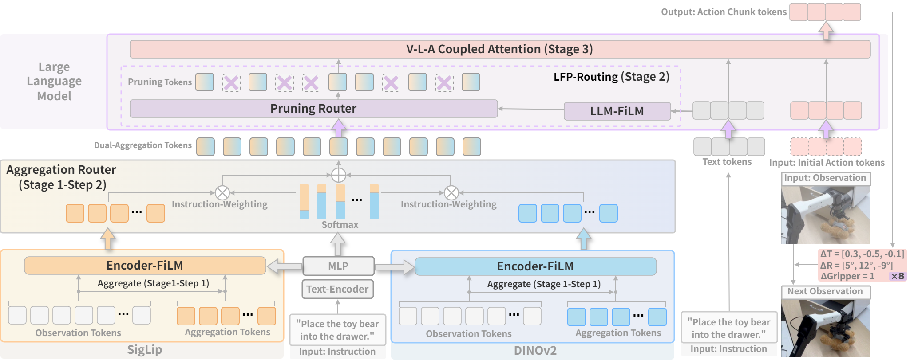
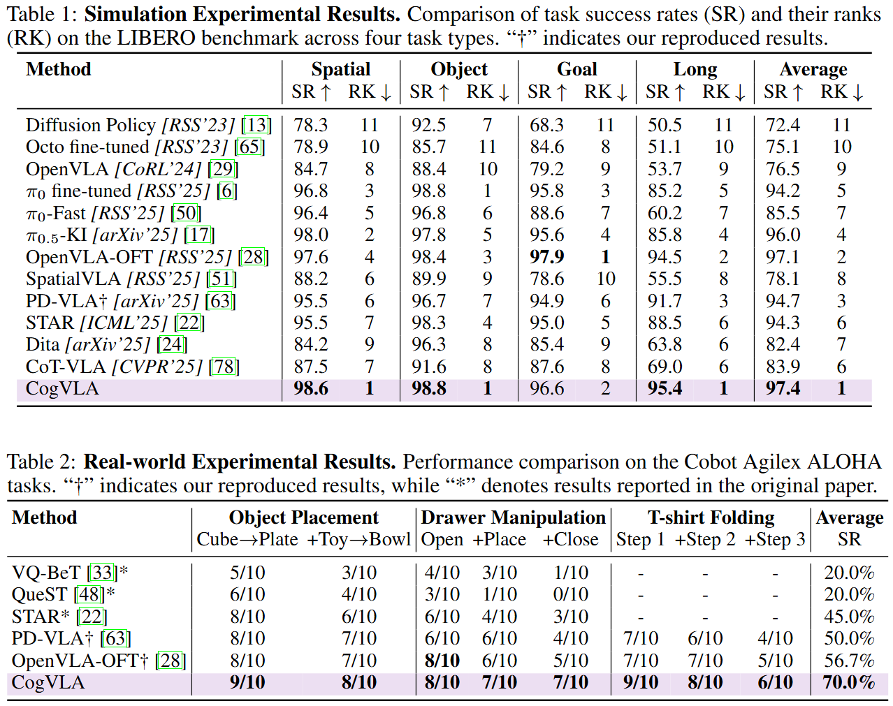
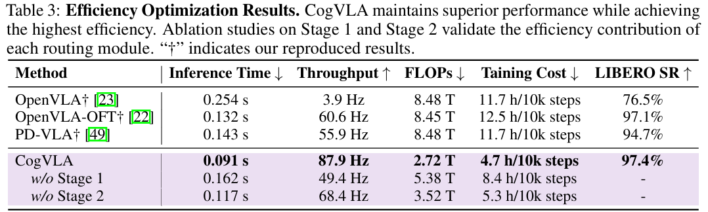

<div align="center">

<!-- <h1>JiuTian (九天) </h1> -->
<h2 class="papername">  CogVLA: Cognition-Aligned Vision-Language-Action Models via Instruction-Driven Routing &amp; Sparsification<br>NeurIPS 2025</h2>
<div>
<div>
    <a href="https://orcid.org/0009-0007-7675-3550" target="_blank">Wei Li</a>,
    <a href="https://scholar.google.com/citations?user=iMJYtvwAAAAJ" target="_blank">Renshan Zhang</a>,
    <a href="https://rshaojimmy.github.io/OrionLab/" target="_blank">Rui Shao*</a>,
    <a href="https://orcid.org/0009-0001-9102-7051" target="_blank">Jie He</a>,
    <a href="https://liqiangnie.github.io/index.html" target="_blank">Liqiang Nie</a>
</div>

School of Computer Science and Technology, Harbin Institute of Technology, Shenzhen<br>
*Corresponding author

[](https://arxiv.org/abs/2508.21046)
[](https://jiutian-vl.github.io/CogVLA-page/)

<h3 align="center">
  <strong>🔥CogVLA is accepted to NeurIPS 2025!🔥<br>⭐ Give us a star if you like it! ⭐</strong>
</h3>


</div>
</div>


## :fire: Updates

- [09/2025] :fire: Code released. Enjoy it!
- [09/2025] :fire: CogVLA is accepted to **NeurIPS 2025**!
- [08/2025] :fire: [Project page](https://jiutian-vl.github.io/CogVLA-page/) released.
- [08/2025] :fire: [arXiv paper](https://arxiv.org/abs/2508.21046) released.

## Introduction

This is the github repository of *CogVLA: Cognition-Aligned Vision-Language-Action Models via Instruction-Driven Routing \& Sparsification*. CogVLA draws inspiration from human multimodal coordination and introduces a 3-stage progressive architecture. 

Extensive experiments on the LIBERO benchmark and real-world robotic tasks demonstrate that CogVLA achieves state-of-the-art performance with success rates of 97.4\% and 70.0\%, respectively, while reducing training costs by 2.5× and decreasing inference latency by 2.8× compared to OpenVLA.

<div align="center">

</div>

The overall framework of CogVLA is illustrated below.

<div align="center">

</div>

## Installation

```bash
# Create and activate conda environment
conda create -n cogvla python=3.10 -y
conda activate cogvla

# Clone CogVLA repo and pip install to download dependencies
git clone git@github.com:JiuTian-VL/CogVLA.git
cd CogVLA
pip install -e .

# Install Flash Attention 2 for training
pip install packaging ninja
ninja --version; echo $?  # Verify Ninja --> should return exit code "0"
pip install "flash-attn==2.5.5" --no-build-isolation
```

## Quick Start

Download the checkpoint from [Hugging Face](https://github.com/JiuTian-VL/CogVLA). 

Fill the checkpoint path in `demo.py`. Then run the following command

```bash
CUDA_VISIBLE_DEVICES=0 python demo.py
```

## Training and Evaluation

See [LIBERO.md](docs/LIBERO.md) for fine-tuning/evaluating on LIBERO simulation benchmark task suites.

See [ALOHA.md](docs/ALOHA.md) for fine-tuning/evaluating on real-world ALOHA robot tasks.

## Experiments

**Performance.** CogVLA achieves state-of-the-art performance with success rates of 97.4\% and 70.0\% on simulation and real-world tasks, respectively.

<div align="center">

</div>

**Efficiency.** CogVLA also reduces training costs by 2.5× and decreases inference latency by 2.8× compared to OpenVLA.

<div align="center">

</div>

## Visualization

The attention maps of CogVLA highlight task-relevant regions in the input image, well aligning with human cognition during task execution.

<div align="center">

</div>

## :fire: Citation

If you find this work useful for your research, please kindly cite our paper.

```
@article{li2025cogvla,
  title={CogVLA: Cognition-Aligned Vision-Language-Action Model via Instruction-Driven Routing \& Sparsification},
  author={Li, Wei and Zhang, Renshan and Shao, Rui and He, Jie and Nie, Liqiang},
  journal={Advances in neural information processing systems},
  year={2025}
}
```

[](https://www.star-history.com/#JiuTian-VL/CogVLA&Date)


